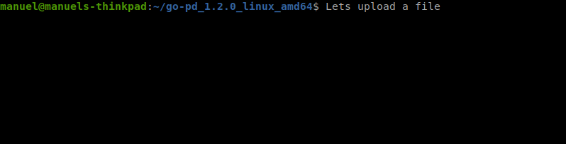

[](https://github.com/ManuelReschke/go-pd/releases)


# Go-PD - A pixeldrain.com client pkg and CLI tool


A free pixeldrain.com client written in go. We use the super power from [imroc/req](https://github.com/imroc/req) (v0.3.2) to build a robust and fast pixeldrain client and [cobra](https://github.com/spf13/cobra) for our CLI tool.



## Content:
- [Using the CLI tool](#cli-tool)
  - [CLI Tool: Install](#cli-tool-install)
  - [CLI Tool: Upload a file](#cli-tool-upload-a-file)
  - [CLI Tool: Download a file](#cli-tool-download-a-file)
- [Using the client pkg](#client-pkg)
  - [Why?](#why)
  - [Import pkg](#import-the-pkg)
  - [Example 1 - the easiest way to upload an anonymous file](#example-1---the-easiest-way-to-upload-an-anonymous-file)
  - [Example 2 - advanced way to upload a file to user account](#example-2---advanced-way-to-upload-a-file-to-user-account)
- [ToDo's](#todos)
- [Covered methods](#pixeldrain-methods-covered-by-this-package)
- [License](#license)

<a name="cli-tool"></a>
# Using the CLI tool

## CLI Tool: Install

Follow the link to download the correct binary for your system. [View Releases](https://github.com/ManuelReschke/go-pd/releases). It's available for Linux, ARM and Windows.
Download the correct archive, extract it and use the binary.

## CLI Tool: Upload a file

Go to the folder where you download the binary file and run the following command in a CLI.

**Simple upload:**

```
 ./go-pd upload my-cat.jpg
 
 Output:
 https://pixeldrain.com/u/aaaaaaaa
```

**Upload to your account (-verbose):**

```
 ./go-pd upload -k <your-api-key> -v my-cat.jpg my-cat2.jpg
 
 Output:
 Successful! Anonymous upload: false | ID: xBxxxxxx | URL: https://pixeldrain.com/u/xBxxxxxx
 Successful! Anonymous upload: false | ID: xAxxxxxx | URL: https://pixeldrain.com/u/xAxxxxxx
```

## CLI Tool: Download a file

Go to the folder where you download the binary file and run the following command in a CLI.

**Simple download:**

```
 ./go-pd download https://pixeldrain.com/u/YqiUjXXX
 
 Output:
 /the/path/to/your/file
```

**Download multiple files to a specific path (-verbose):**

```
 ./go-pd download -k <your-api-key> -p /home/pixeldrain/pictures/ YqiUjXXX YqiUjX02 YqiUjX03
 
 Output:
 Successful! Download complete: filename01.jpg | ID: xBxxxxxx | Stored to: /home/pixeldrain/pictures/filename01.jpg
 Successful! Download complete: filename02.jpg | ID: xBxxxxxx | Stored to: /home/pixeldrain/pictures/filename02.jpg
 Successful! Download complete: filename03.jpg | ID: xBxxxxxx | Stored to: /home/pixeldrain/pictures/filename03.jpg
```

<a name="client-pkg"></a>
# Using the client pkg

<a name="why"></a>
## Why the package?

Because we want a simple, fast, robust and tested go package to upload to pixeldrain.com.

<a name="import-the-pkg"></a>
### Import the pkg

```
 go get github.com/ManuelReschke/go-pd/pkg/pd
```

## Example 1 - the easiest way to upload an anonymous file

```go
package main

import (
	"fmt"
	"time"

	"github.com/ManuelReschke/go-pd/pkg/pd"
)

func main() {
	req := &pd.RequestUpload{
		PathToFile: "testdata/cat.jpg",
		Anonymous:  true,
	}

	c := pd.New(nil, nil)
	rsp, err := c.UploadPOST(req)
	if err != nil {
		fmt.Println(err)
	}

	// print the full URL
	fmt.Println(rsp.GetFileURL())

        // example ID = xFNz76Vp
        // example URL = https://pixeldrain.com/u/xFNz76Vp
}
```

## Example 2 - advanced way to upload a file to user account

```go
package main

import (
	"fmt"
	"time"

	"github.com/ManuelReschke/go-pd/pkg/pd"
)

func main() {
	req := &pd.RequestUpload{
		PathToFile: "testdata/cat.jpg",
		FileName:   "test_post_cat.jpg",
		Anonymous:  false,
		Auth: pd.Auth{
			APIKey: "you-api-key-from-pixeldrain-account",
		},
	}

	// set specific request options
	opt := &pd.ClientOptions{
		Debug:             false,
		ProxyURL:          "example.socks5.proxy",
		EnableCookies:     true,
		EnableInsecureTLS: true,
		Timeout:           1 * time.Hour,
	}

	c := pd.New(opt, nil)
	rsp, err := c.UploadPOST(req)
	if err != nil {
		fmt.Println(err)
	}

	// print the full URL
	fmt.Println(rsp.GetFileURL())

        // example ID = xFNz76Vp
        // example URL = https://pixeldrain.com/u/xFNz76Vp
}
```
## ToDo's:

- [x] implement simple upload method over POST /file
- [x] implement simple upload over PUT /file/{filename}
- [x] write unit tests
- [x] write integration tests
- [x] add API-KEY auth to requests
- [x] implement all other API methods
  - [x] implement GET - /file/{id}
  - [x] implement GET - /file/{id}/info
  - [x] implement GET - /file/{id}/thumbnail?width=x&height=x
  - [x] implement DELETE - /file/{id}
  - [x] implement POST - /list
  - [X] implement GET - /list/{id}
  - [x] implement GET - /user
  - [x] implement GET - /user/files
  - [x] implement GET - /user/lists
- [x] create CLI tool for uploading to pixeldrain.com
- [ ] refactor the hole shit and use nice to have patterns (like Option Pattern)
- [ ] update imroc/req to the latest version (check if memory leak exist)

## PixelDrain methods covered by this package

### File Methods
| PixelDrain Call                                 |  Package Func |
|-------------------------------------------------|---|
| [x] POST - /file                                | UploadPOST(r *RequestUpload) (*ResponseUpload, error) |
| [x] PUT - /file/{name}                          | UploadPUT(r *RequestUpload) (*ResponseUpload, error) |
| [x] GET - /file/{id}                            | Download(r *RequestDownload) (*ResponseDownload, error) |
| [x] GET - /file/{id}/info                       | GetFileInfo(r *RequestFileInfo) (*ResponseFileInfo, error) |
| [x] GET - /file/{id}/thumbnail?width=x&height=x | DownloadThumbnail(r *RequestThumbnail) (*ResponseThumbnail, error)  |
| [x] DELETE - /file/{id}                         | Delete(r *RequestDelete) (*ResponseDelete, error)  |
### List Methods
| PixelDrain Call      |  Package Func |
|----------------------|---|
| [x] POST - /list     | CreateList(r *RequestCreateList) (*ResponseCreateList, error)  |
| [x] GET - /list/{id} | GetList(r *RequestGetList) (*ResponseGetList, error)  |
### User Methods
| PixelDrain Call        |  Package Func |
|------------------------|---|
| [x] GET - /user        | GetUser(r *RequestGetUser) (*ResponseGetUser, error)  |
| [x] POST - /user/files | GetUserFiles(r *RequestGetUserFiles) (*ResponseGetUserFiles, error) |
| [x] GET - /user/lists  | GetUserLists(r *RequestGetUserLists) (*ResponseGetUserLists, error) |

## Package CLI commands

### Unit Tests - Run pkg unit tests
Run unit tests against a local emulated server.
```shell
make test
```

### Integration Tests - Run pkg integration tests
Run real integration tests against the real pixeldrain.com website.
```shell
make test-integration
```

### Test Coverage - create test coverage report
Create a coverage report c.out and a coverage.html to view the results in web browser
```shell
make coverage
```

## Thanks to 
Special thanks to Visual Studio Code and to Jetbrains for this amazing IDE and [supporting the open source community](https://www.jetbrains.com/de-de/community/opensource/#support).

## License

This software is released under the MIT License, see LICENSE.
